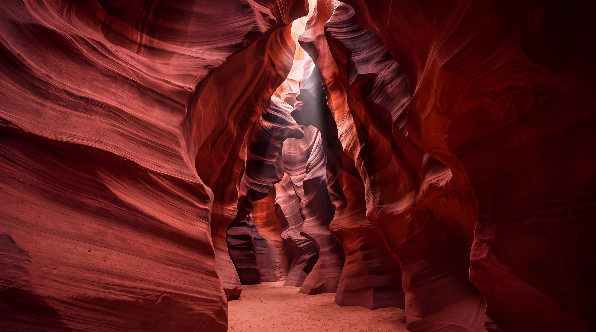
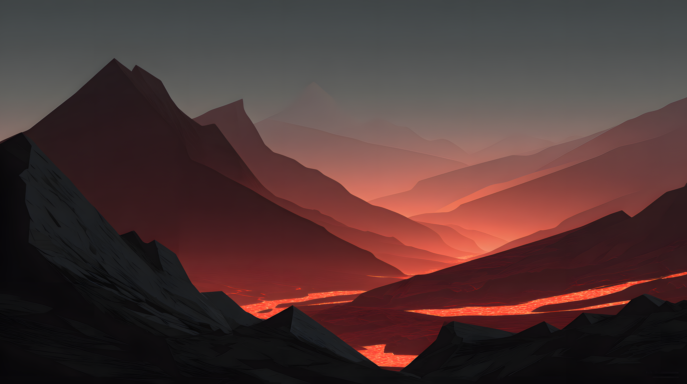
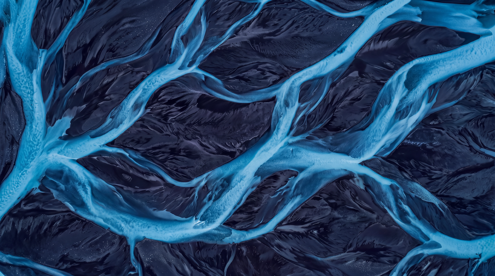
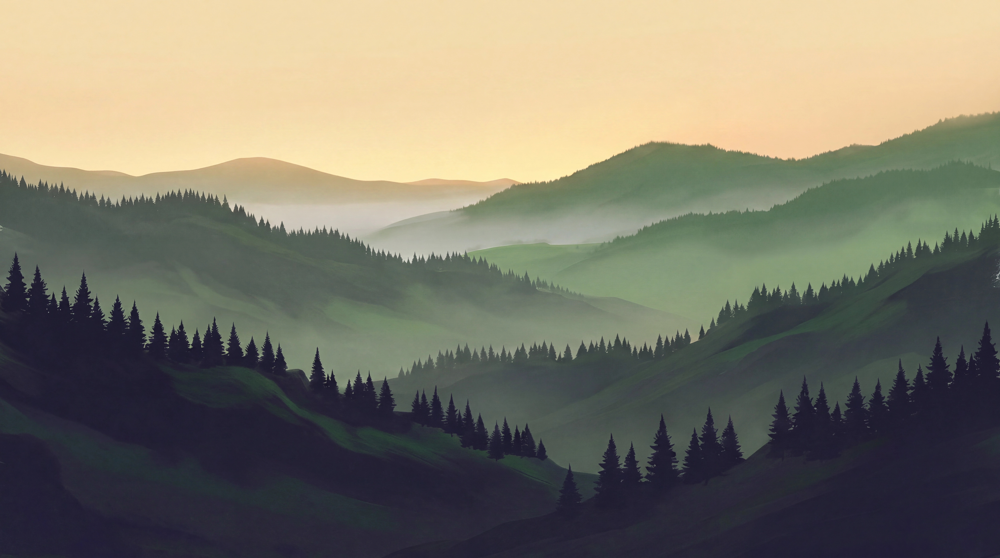
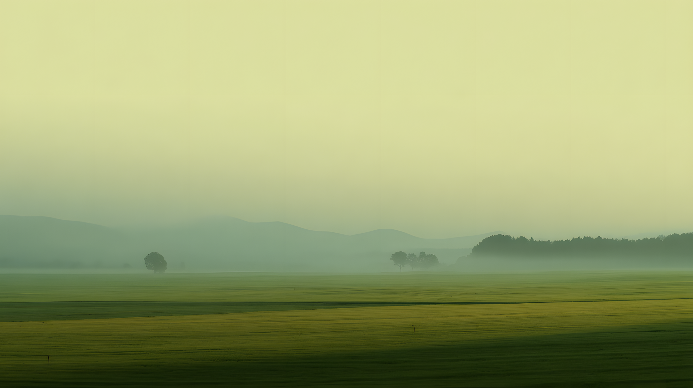
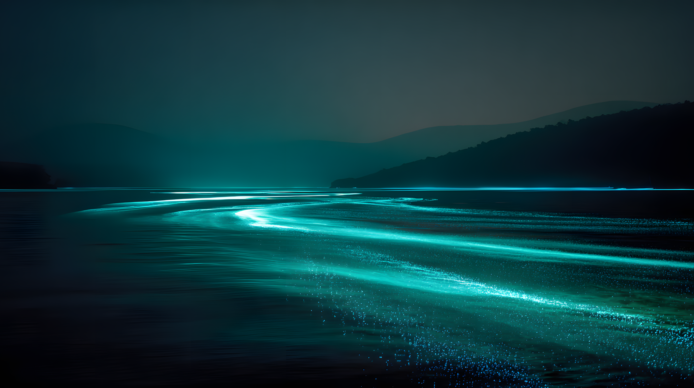
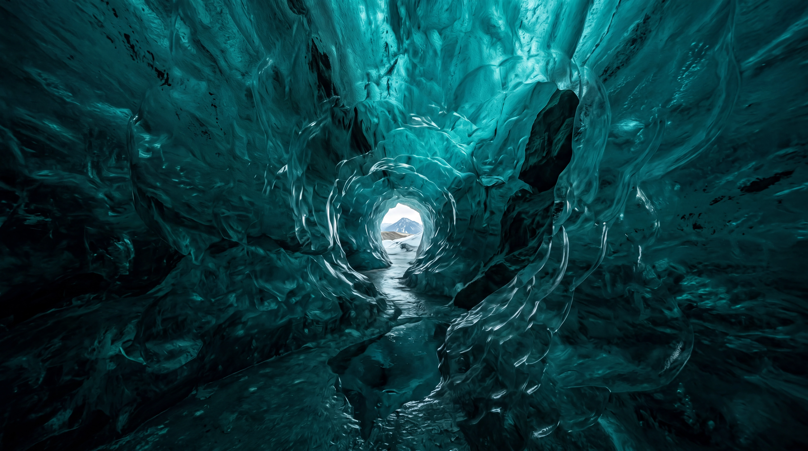

# Celestial Backgrounds

A collection of minimalistic backgrounds designed to complement the Celestial GTK theme variants.

## Collection

Each theme has its own color-coordinated background collection:

### Aliz (Coral Red)

**Primary Color:** `#f0544c`
**Dark Accent:** `#222222`

#### Aliz-Abstract.webp

Dynamic abstract design with flowing shapes


#### Aliz-Canyon.webp

Sculpted slot canyon walls in deep coral with a shaft of daylight from above



#### Aliz-Temple.webp

Layered pagoda temple scene with coral sun and mountain silhouettes


#### Aliz-Volcano.webp

Minimalistic volcanic landscape with glowing lava flows and layered rock formations



### Azul (Blue)

**Primary Color:** `#3498db`
**Dark Accent:** `#1b1d24`

#### Azul-Abstract.webp

Material design wallpaper with clean geometric shapes and blue tones


#### Azul-Delta.webp

Aerial view of braided glacial meltwater channels winding through dark sediment



#### Azul-Ice.webp

Serene Arctic landscape with layered icebergs and frozen waters


#### Azul-Space.webp

Abstract space scene with nebula clouds


### Pueril (Green)

**Primary Color:** `#97bb72`
**Dark Accent:** `#222222`

#### Pueril-Bamboo.webp

Misty bamboo grove with layered depth and silhouettes


#### Pueril-Forest.webp

Minimalistic forest scene with soft lighting


#### Pueril-Hills.webp

Layered hills fading into morning haze beneath a golden dawn sky



#### Pueril-Meadow.webp

Peaceful meadow landscape at dawn with morning mist and soft green tones



### Sea (Teal)

**Primary Color:** `#2eb398`
**Dark Accent:** `#1b2224`

#### Sea-Bioluminescence.webp

Bioluminescent bay at night with glowing plankton creating ethereal teal light



#### Sea-Glacier.webp

Glacial ice cave in luminous teal, opening onto a distant mountain



#### Sea-Turtles.webp

Sea turtles swimming through sunlit ocean depths with coral silhouettes


#### Sea-Underwater.webp

Serene underwater scene with bioluminescent elements


## Design Philosophy

All backgrounds follow these principles:

- **Minimalistic:** Clean, uncluttered designs that don't distract from your work
- **Professional:** Suitable for workspace environments
- **Color Matched:** Carefully coordinated with each theme's color palette
- **High Resolution:** QHD+ quality for modern displays
- **Versatile:** Works well with both light and dark theme variants

## Installation

### Using the Installer (Recommended)

Install backgrounds using the `-b` flag:

```bash
# Install backgrounds for all themes
./install.sh -b

# Install backgrounds for specific theme
./install.sh -b -t azul

# Install multiple specific themes
./install.sh -b -t sea -t pueril
```

#### Installation Locations

Backgrounds will be installed to:

- **User install (default):** `~/.local/share/backgrounds/celestial/`
- **System-wide install (with sudo):** `/usr/share/backgrounds/celestial/`

#### Desktop Environment Integration

The installer automatically creates theme-specific XML property files for each installed theme:

- **GNOME:** `gnome-background-properties/celestial-[theme].xml`
- **MATE:** `mate-background-properties/celestial-[theme].xml`
- **Cinnamon:** `cinnamon-background-properties/celestial-[theme].xml`
- **Xfce:** Manual selection from file manager (no XML needed)

After installation, backgrounds will appear automatically in your desktop environment's wallpaper settings grouped by theme. For example:

- "Aliz Abstract", "Aliz Temple", "Aliz Volcano" (from celestial-aliz.xml)
- "Azul Abstract", "Azul Ice", "Azul Space" (from celestial-azul.xml)
- "Pueril Bamboo", "Pueril Forest", "Pueril Meadow" (from celestial-pueril.xml)
- "Sea Bioluminescence", "Sea Turtles", "Sea Underwater" (from celestial-sea.xml)

**Slideshow Mode:** Since backgrounds are grouped by theme color, you can enable slideshow mode in your desktop environment to automatically rotate between color-coordinated wallpapers!

XML files are generated when themes are installed and removed when themes are uninstalled.

### Uninstalling

Remove all backgrounds:

```bash
./install.sh -b -r
```

Remove specific theme backgrounds:

```bash
./install.sh -b -r -t azul
```

### Manual Installation

Copy the background files to your preferred location:

```bash
mkdir -p ~/.local/share/backgrounds/celestial/
cp -r src/extra/backgrounds/{aliz,azul,pueril,sea} ~/.local/share/backgrounds/celestial/
```

Then set via your desktop environment's wallpaper/background settings.

## Desktop Environment Support

Backgrounds are supported on:

- **GNOME** - Appears in Settings > Background
- **MATE** - Appears in System Settings > Appearance > Background
- **Cinnamon** - Appears in System Settings > Backgrounds
- **Xfce** - Manual selection from Settings Manager > Desktop > Background

## Contributing

Have a background design that fits the Celestial aesthetic? We welcome contributions!

Please ensure designs:

- Match the theme color palettes (see colors above)
- Maintain the minimalistic philosophy
- Are high resolution (minimum 2560x1440, prefer QHD+ 2880x1620)
- Are provided in WebP format for optimal file size (under 5 MB)
- Are named consistently: `[Theme]-[Description].webp` (e.g., `Azul-Space.webp`)
- Include appropriate color values for XML integration
