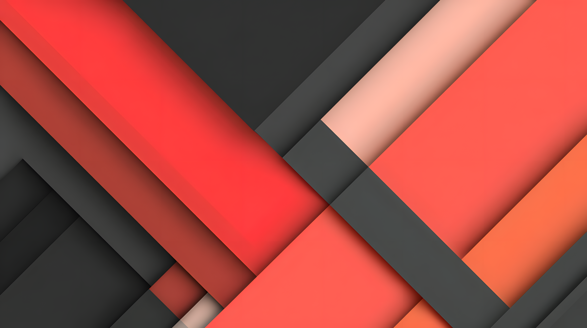
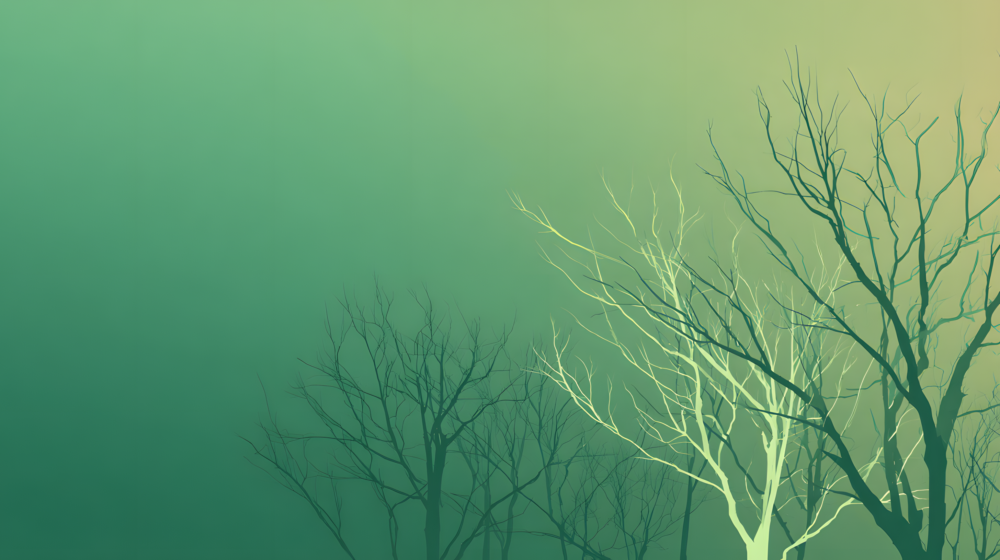
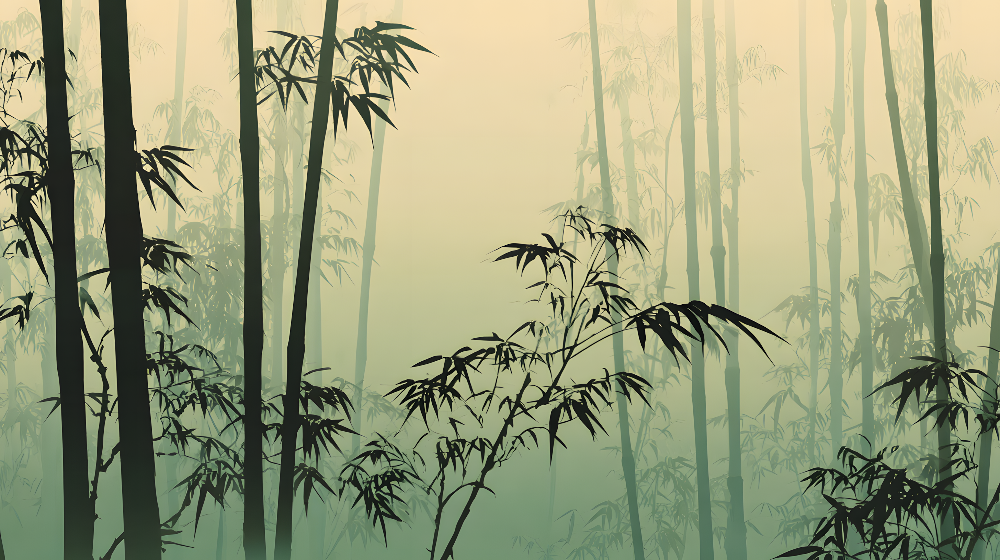
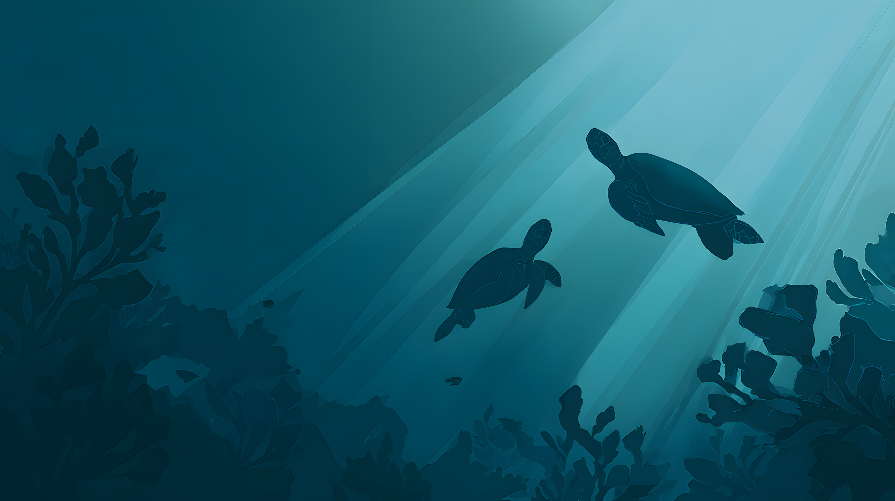

# Celestial Backgrounds

A collection of minimalistic backgrounds designed to complement the Celestial GTK theme variants.

## Collection

Each theme has its own color-coordinated background collection:

### Aliz (Coral Red)

**Primary Color:** `#f0544c`
**Dark Accent:** `#222222`

#### Aliz-Abstract.webp

Dynamic abstract design with flowing shapes



#### Aliz-Temple.webp

Layered pagoda temple scene with coral sun and mountain silhouettes


### Azul (Blue)

**Primary Color:** `#3498db`
**Dark Accent:** `#1b1d24`

#### Azul-Space.webp

Abstract space scene with nebula clouds


#### Azul-Ice.webp

Serene Arctic landscape with layered icebergs and frozen waters


### Pueril (Green)

**Primary Color:** `#97bb72`
**Dark Accent:** `#222222`

#### Pueril-Forest.webp

Minimalistic forest scene with soft lighting



#### Pueril-Bamboo.webp

Misty bamboo grove with layered depth and silhouettes



### Sea (Teal)

**Primary Color:** `#2eb398`
**Dark Accent:** `#1b2224`

#### Sea-Underwater.webp

Serene underwater scene with bioluminescent elements


#### Sea-Turtles.webp

Sea turtles swimming through sunlit ocean depths with coral silhouettes



## Design Philosophy

All backgrounds follow these principles:

- **Minimalistic:** Clean, uncluttered designs that don't distract from your work
- **Professional:** Suitable for workspace environments
- **Color Matched:** Carefully coordinated with each theme's color palette
- **High Resolution:** QHD+ quality for modern displays
- **Versatile:** Works well with both light and dark theme variants

## Installation

### Using the Installer (Recommended)

Install backgrounds using the `-b` flag:

```bash
# Install backgrounds for all themes
./install.sh -b

# Install backgrounds for specific theme
./install.sh -b -t azul

# Install multiple specific themes
./install.sh -b -t sea -t pueril
```

#### Installation Locations

Backgrounds will be installed to:

- **User install (default):** `~/.local/share/backgrounds/celestial/`
- **System-wide install (with sudo):** `/usr/share/backgrounds/celestial/`

#### Desktop Environment Integration

The installer automatically creates a single XML property file for all installed backgrounds:

- **GNOME:** `gnome-background-properties/celestial.xml`
- **MATE:** `mate-background-properties/celestial.xml`
- **Cinnamon:** `cinnamon-background-properties/celestial.xml`
- **Xfce:** Manual selection from file manager (no XML needed)

After installation, all backgrounds will appear automatically in your desktop environment's wallpaper settings under "Celestial" with names like "Aliz Abstract", "Azul Space", "Pueril Forest", "Sea Underwater".

The XML file is regenerated whenever backgrounds are installed or removed to always reflect the current set of installed backgrounds.

### Uninstalling

Remove all backgrounds:

```bash
./install.sh -b -r
```

Remove specific theme backgrounds:

```bash
./install.sh -b -r -t azul
```

### Manual Installation

Copy the background files to your preferred location:

```bash
mkdir -p ~/.local/share/backgrounds/celestial/
cp -r src/extra/backgrounds/{aliz,azul,pueril,sea} ~/.local/share/backgrounds/celestial/
```

Then set via your desktop environment's wallpaper/background settings.

## Desktop Environment Support

Backgrounds are supported on:

- **GNOME** - Appears in Settings → Background
- **MATE** - Appears in System Settings → Appearance → Background
- **Cinnamon** - Appears in System Settings → Backgrounds
- **Xfce** - Manual selection from Settings Manager → Desktop → Background

## Contributing

Have a background design that fits the Celestial aesthetic? We welcome contributions!

Please ensure designs:

- Match the theme color palettes (see colors above)
- Maintain the minimalistic philosophy
- Are high resolution (minimum 2560×1440, prefer QHD+ 2880×1620)
- Are provided in WebP format for optimal file size (under 5 MB)
- Are named consistently: `[Theme]-[Description].webp` (e.g., `Azul-Space.webp`)
- Include appropriate color values for XML integration
